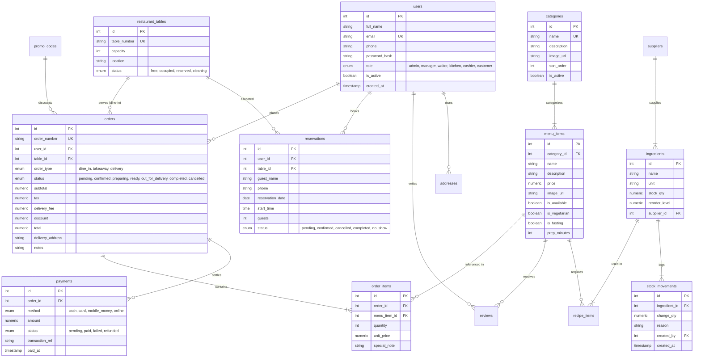

# Sami Cafe and Restaurant - Entity Relationship Diagram (ERD)

This document visualizes the 3NF normalized relational schema implemented in PostgreSQL.

```mermaid
erDiagram
    users ||--o{ orders : places
    users ||--o{ reservations : books
    users ||--o{ reviews : writes
    users ||--o{ addresses : owns

    categories ||--|{ menu_items : categorizes
    orders ||--|{ order_items : contains
    menu_items ||--o{ order_items : "referenced in"
    menu_items ||--o{ reviews : receives
    menu_items ||--o{ recipe_items : requires

    restaurant_tables ||--o{ orders : "serves (dine-in)"
    restaurant_tables ||--o{ reservations : allocated

    orders ||--o{ payments : settles
    promo_codes ||--o{ orders : discounts

    suppliers ||--|{ ingredients : supplies
    ingredients ||--|{ recipe_items : "used in"
    ingredients ||--|{ stock_movements : logs

    users {
        int id PK
        string full_name
        string email UK
        string phone
        string password_hash
        enum role "admin, manager, waiter, kitchen, cashier, customer"
        boolean is_active
        timestamp created_at
    }

    categories {
        int id PK
        string name UK
        string description
        string image_url
        int sort_order
        boolean is_active
    }

    menu_items {
        int id PK
        int category_id FK
        string name
        string description
        numeric price
        string image_url
        boolean is_available
        boolean is_vegetarian
        boolean is_fasting
        int prep_minutes
    }

    restaurant_tables {
        int id PK
        string table_number UK
        int capacity
        string location
        enum status "free, occupied, reserved, cleaning"
    }

    reservations {
        int id PK
        int user_id FK
        int table_id FK
        string guest_name
        string phone
        date reservation_date
        time start_time
        int guests
        enum status "pending, confirmed, cancelled, completed, no_show"
    }

    orders {
        int id PK
        string order_number UK
        int user_id FK
        int table_id FK
        enum order_type "dine_in, takeaway, delivery"
        enum status "pending, confirmed, preparing, ready, out_for_delivery, completed, cancelled"
        numeric subtotal
        numeric tax
        numeric delivery_fee
        numeric discount
        numeric total
        string delivery_address
        string notes
    }

    order_items {
        int id PK
        int order_id FK
        int menu_item_id FK
        int quantity
        numeric unit_price
        string special_note
    }

    payments {
        int id PK
        int order_id FK
        enum method "cash, card, mobile_money, online"
        numeric amount
        enum status "pending, paid, failed, refunded"
        string transaction_ref
        timestamp paid_at
    }

    ingredients {
        int id PK
        string name
        string unit
        numeric stock_qty
        numeric reorder_level
        int supplier_id FK
    }

    stock_movements {
        int id PK
        int ingredient_id FK
        numeric change_qty
        string reason
        int created_by FK
        timestamp created_at
    }
```
